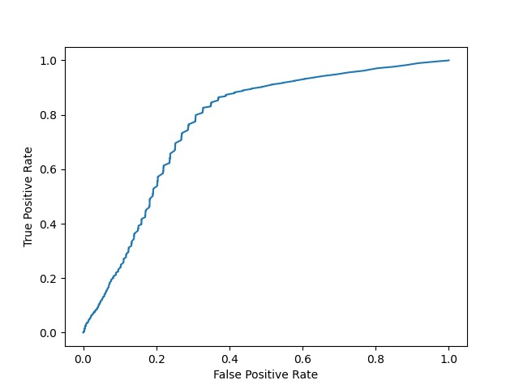
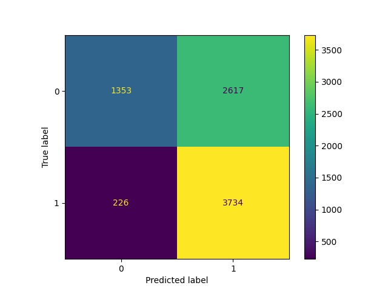
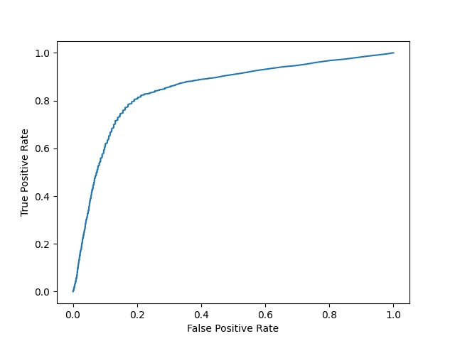
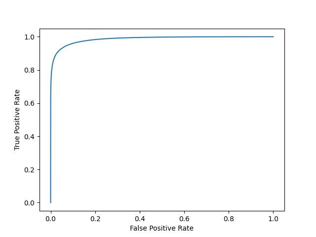
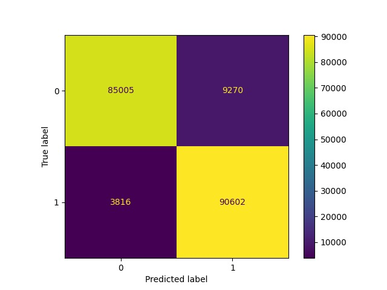
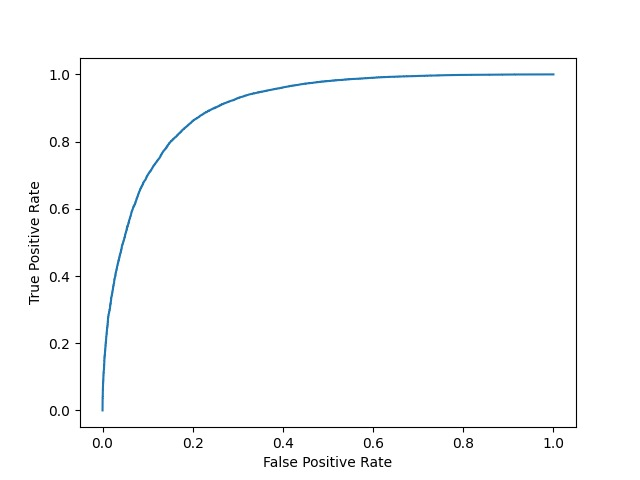
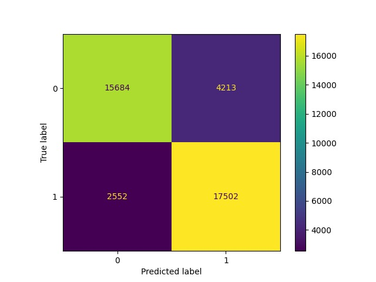

# Project README

## Description

This project contains code for a language classification task, where the goal is to classify text data as either fluent or non-fluent. The project uses various models and techniques such as linear classifiers, statistical models, LSTMs, and RoBERTa base models.

## Files

- `csvPerpParseKN.py`: This file contains a linear classifier based on the Kneser-Ney model.
- `csvPerpParseLSTM.py`: This file contains a linear classifier based on the LSTM model.
- `csvPerpParseWB.py`: This file contains a linear classifier based on Witten-Bell model.

- `dataPrep.py`: This file contains the code for preparing the data PKL
- `grammar_correcting_model.py`: This file contains the code for a grammar correcting model that uses T5, a transformer-based language model developed by Google.
- `LSTM.py`: This file contains the code for the LSTM model.
- `perpSC.py`: This file contains the code for a sequence classifier based on the RoBERTa base model.

- `stat_model.py`: This file contains the code for a statistical language model used for the language classification task.

## Execution Order

To begin with, run `dataPrep.py` to prepare the data PKL.

The `grammar_correcting_model.py` can be run independently.

Next, run `LSTM.py` followed by `csvPerpParseLSTM.py`.

Then, run `stat_model.py` followed by `csvPerpParseWB.py` and `csvPerpParseKN.py`.

Finally, `perpSC.py` can be run independently once the data preparation is complete.

Addendum: https://1drv.ms/f/s!AlS9diCw3ZVTqgmQ3kW78T_et2kp?e=0IRgqc

## Results and Observations

| ROC Curves                          | Confusion Matrix                    |
| ----------------------------------- | ----------------------------------- |
|  |  |
|  |  |
|  |  |
|  |  |

